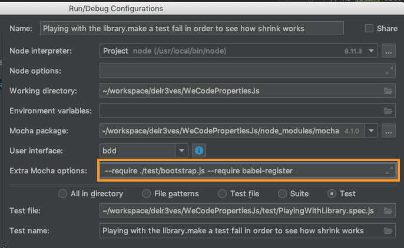

# WeCodePropertiesJs 

Welcome to the JavaScript implementation of WeCodeFest's property based testing workshop.

## Working with the project

The first thing you need to do is to install the dependnecies. You can do it by executing:

```
yarn install
```

The most important thing you'll want to do with this project is just running the tests. To do so, you just have to execute:

```
yarn test
```

In case you want to run the tests using your IDE, you'll need to add ` --require ./test/bootstrap.js --require babel-register` flags to the mocha config. 

In case you are a Intellij/Webstrom user, this is how I configured it:



**Or you can just add `require("./bootstrap");` as the first line of your test class and that's all :)**

## Libraries: 

To implement this project, we'll use:
 * [mocha](https://mochajs.org/) as the runner
 * [chai](https://www.chaijs.com) for assertions
 * [jsverify](http://jsverify.github.io/) for properties. Here you can find how you can configure the properties. With this library is quite easy how to rerun the tests with the same seed to generate exactly the same tests between executions.

## Branches:

This project contains a few branches in order to help you with irrelevant implementation details that could be time consuming but don't add any value to this Workshop.  

### Project scafolding:
Just a simple scafolding of a Js project in order to run the tests

```
git checkout scafolding
```

### Sum properties (15'):
In this branch, you'll find the definition of each test we'll need to implement in order to test a sum.
Just find the test in [WeCodePlayground.spec.js](test/WeCodePlayground.spec.js)

```
git checkout sum-properties
```
In case you want solved exercises:
```
git checkout sum-properties-solved
```

### Know your tooling (15')
It's time to know about the internals of the library, so we'll just play with the tool.
Just find the test in [PlayingWithLibrary.spec.js](test/PlayingWithLibrary.spec.js)

```
git checkout playing-with-library
```

```
git checkout playing-with-library-solved
```

### Fibonacci properties (5'):
What do you think is the main property fibonacci should keep?
Find the test in [Fibonacci.spec.js](test/Fibonacci.spec.js)

```
git checkout fibonacci-properties
```
```
git checkout fibonacci-properties-solved
```

### Collection properties (20'):
Lets find the main properties every collection should keep  
Find the test in [Collections.spec.js](test/Collections.spec.js)

```
git checkout collection-properties
```
```
git checkout collection-properties-solved
```
